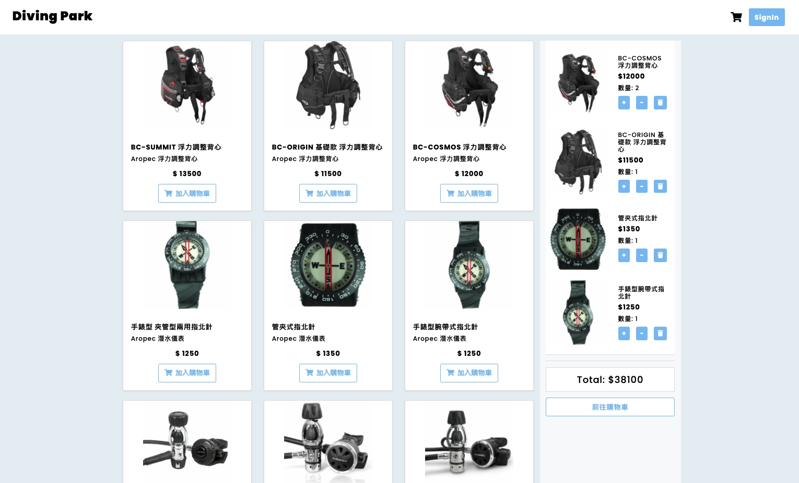

# 購物車

使用純後端製作購物車，工具包含 Nodejs、Express、Mysql，功能包含註冊登入驗證、購物車基本操作、第三方金流串接，在本網站上可以直接完成購物流程。

## 1. 使用技術

+ Nodejs
+ Express
+ Mysql

## 2. 部屬網站

```
https://shopping-cart-node-mysql.herokuapp.com/
```

## 3. 測試帳號 & 信用卡(一次付清)

```
管理者 Admin
email: root@example.com
password: 12345678

使用者 User
email: user1@example.com
password: 12345678

信用卡號
4000-2211-1111-1111
日期、驗證碼隨意
```

## 3. 產品功能

### 首頁



#### < 後台登入 >

+ 僅有 admin 權限者才能登入
+ 管理者可以瀏覽所有商品資訊
+ 管理者可以新增、編輯、刪除商品
+ 管理者可以瀏覽所有訂單資訊
+ 管理者可以修改訂單狀態
+ 管理者可以瀏覽所有使用者資訊
+ 管理者可以修改使用者權限

#### < 前台登入 & 註冊 >

+ 使用者需設定信箱、密碼，並到信箱收到驗證碼，才能註冊成功
+ 使用者註冊成功後，即可登入

#### < 商品首頁 >

+ 使用者點擊 LOGO 回到商品首頁
+ 使用者點擊 SignIn 進到登入頁面
+ 使用者點擊 SignOut 即可登出使用者
+ 使用者可以瀏覽所有商品
+ 使用者點擊加入購物車，可以將商品放入到購物車內
+ 使用者點擊 + / - 可以增加或減少商品數量
+ 使用者點擊垃圾桶可以將商品移除購物車
+ 使用者點擊進入購物車，需登入後才能使用

#### < 購物車頁面 >

+ 使用者可以瀏覽購物車內所有商品資訊
+ 使用者點擊 + / - 可以增加或減少商品數量
+ 使用者點擊垃圾桶可以將商品移除購物車
+ 使用者需填寫姓名、電話、地址，並成立訂單
+ 使用者點擊前往付款，會跳轉至藍新第三方支付

#### < 訂單頁面 >

+ 使用者可以瀏覽自己所有訂單
+ 使用者點擊詳細資訊，可以看到訂單詳情
+ 使用者點擊取消訂單，可將訂單取消

## 4. 安裝流程

1. 開啟終端機

```
$ git clone https://github.com/ben7152000/shopping-cart.git
```

2. 進入資料夾

```
$ cd shopping-cart
```

3. 安裝套件

```
$ npm install
```

4. 新增 .env 檔案

```
PORT=

SESSION_SECRET=

USER_MAIL=

GMAIL_ACCOUNT=
GMAIL_PASSWORD=

NEWEBPAY_URL=
NEWEBPAY_MERCHANT_ID=
NEWEBPAY_HASH_KEY=
NEWEBPAY_HASH_IV=

JWT_SECRET=
```

5. 修改 config 內的資料庫設定

```
"development": {
  "username": "root",
  "password": "<your_mysql_workbench_password>",
  "database": "shopping_cart",
  "host": "127.0.0.1",
  "dialect": "mysql"
}
```

6. 建立資料庫

+ 進到 mysql
```
create database shopping_cart;
use shopping_cart;
```

+ 回到專案
```
npx sequelize db:migrate
```

7. 建立種子資料

```
npm run seed
```

8. 開啟專案

```
npm run dev
```

9. 專案開啟

```
http://localhost:8081
```

## 5. 使用工具

- [WebStorm](https://www.jetbrains.com/webstorm/)
- [Node.js v14.15.4](https://nodejs.dev/)
- [Express](https://www.npmjs.com/package/express)
- [body-parser](https://www.npmjs.com/package/body-parser)
- [mysql2](https://www.npmjs.com/package/mysql2)
- [sequelize](https://www.npmjs.com/package/sequelize)
- [sequelize-cli](https://www.npmjs.com/package/sequelize-cli)
- [passport](https://www.npmjs.com/package/passport)
- [passport-jwt](https://www.npmjs.com/package/passport-jwt)
- [jsonwebtoken](https://www.npmjs.com/package/jsonwebtoken)
- [bcrypt](https://www.npmjs.com/package/bcrypt)
- [connect-flash](https://www.npmjs.com/package/connect-flash)
- [cookie-parser](https://www.npmjs.com/package/cookie-parser)
- [cors](https://www.npmjs.com/package/cors)
- [crypto-js](https://www.npmjs.com/package/crypto-js)
- [dayjs](https://www.npmjs.com/package/dayjs)
- [dotenv](https://www.npmjs.com/package/dotenv)
- [express-handlebars](https://www.npmjs.com/package/express-handlebars)
- [express-session](https://www.npmjs.com/package/express-session)
- [faker](https://www.npmjs.com/package/faker)
- [morgan](https://www.npmjs.com/package/morgan)
- [multer](https://www.npmjs.com/package/multer)
- [nodemailer](https://www.npmjs.com/package/nodemailer)
- [nodemon](https://www.npmjs.com/package/nodemon)
- [path](https://www.npmjs.com/package/path)
- [express-xss-sanitizer](https://www.npmjs.com/package/express-xss-sanitizer)
- [helmet](https://www.npmjs.com/package/helmet)
- [hpp](https://www.npmjs.com/package/hpp)
- [express-rate-limit](https://www.npmjs.com/package/express-rate-limit)
